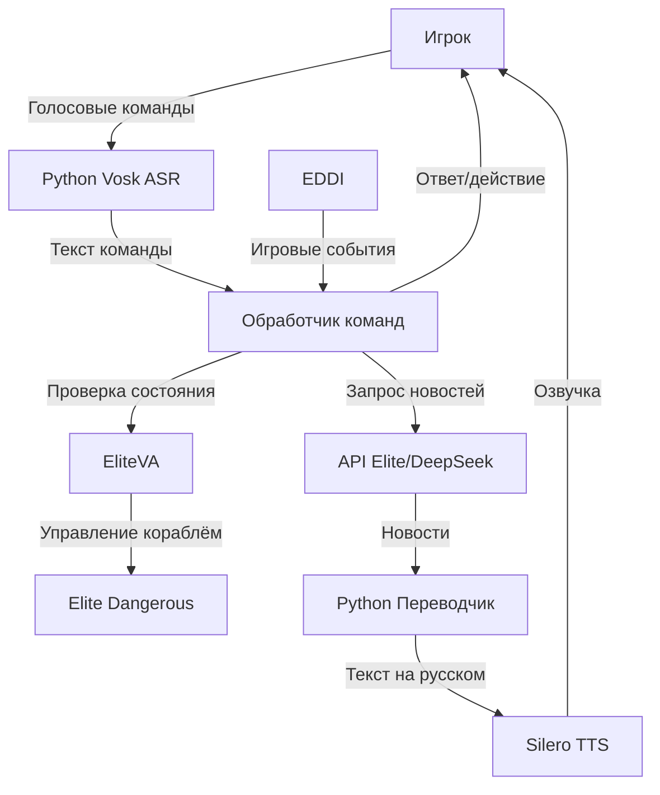

# Elite Voice Control
**Голосовое управление для Elite Dangerous с поддержкой русского языка**

Проект для интеграции голосового управления и обратной связи в Elite Dangerous.

## 🌟 Основные возможности
- **Распознавание речи** через Vosk с поддержкой игрового словаря
- **Синтез речи** через Silero TTS с улучшениями:
  - Автоматическая конвертация чисел в слова (например "256.7" → "двести пятьдесят шесть целых семь десятых")
  - Правильное склонение единиц измерения (тонны/тонн/тонна)
  - Коррекция опечаток через SymSpellPy
- **Мониторинг состояния корабля**:
  - Топливо/щиты/груз в реальном времени
  - Автоматические голосовые уведомления

## 📌 Текущий статус  
- Реализовано базовое распознавание речи через Vosk.  
- Настроена запись аудио в реальном времени с помощью SoundDevice.  
- Добавлена конфигурация для управления настройками (модели, устройства, пути).  
- Тестовый скрипт для проверки работы распознавателя.  
- Реализован синтез речи через Silero
- тестовый скрипт на распознание речи и вывод распознанной речи через синтез речи в реальном времени
- Реализован парсинг логов игры для вывода информации через синтез речи Silero TTS

## 🗺️ Архитектура

## 🚀 Планируемые улучшения  

### Основные задачи:  
- [ ] **Реализация голосовых команд**:  
  - Управление системными приложениями (запуск программ, регулировка громкости).  
  - Интеграция с API (погода, новости, умный дом).  
- [ ] **Улучшение обработки аудио**:  
  - Шумоподавление с использованием `noisereduce`.  
  - Нормализация громкости.  

### Инфраструктура:  
- [ ] **Документация**:  
  - Подробное описание архитектуры проекта.  
  - Руководство для контрибьюторов.  
- [ ] **Тестирование**:  
  - Покрытие unit-тестами.  
  - Интеграция с GitHub Actions.  
- [ ] **UI/UX**:  
  - Графический интерфейс для настройки параметров.  
  - Индикатор активности микрофона.  

### Оптимизация:  
- [ ] Поддержка GPU для ускорения работы моделей.  
- [ ] Кэширование часто используемых команд.  

## 🚧 Вопросы для уточнения и задачи

### Интеграция с EliteVA
- **Текущий статус**: В процессе разработки.
- **Вопросы**:
  - Какой формат данных использует EliteVA (JSON/XML/plain text)?
  - Какие методы API доступны для проверки состояния корабля?
  - Как обрабатывать задержки при запросах к EliteVA?
- **Задачи**:
  - [ ] Реализовать WebSocket-клиент для EliteVA.
  - [ ] Настроить запросы к статусу топлива, щитов и позиции.

### Работа с DeepSeek API
- **Текущий статус**: Требуется настройка.
- **Вопросы**:
  - Какой тип аутентификации используется (API-key/OAuth)?
  - Какие эндпоинты доступны для получения новостей?
- **Задачи**:
  - [ ] Интегрировать модуль запросов к API.
  - [ ] Добавить обработку ошибок (таймауты, квоты).

### Приоритизация событий
- **Текущий статус**: На этапе тестирования.
- **Вопросы**:
  - Какие события EDDI должны иметь максимальный приоритет?
  - Как обрабатывать конфликтующие команды?
- **Задачи**:
  - [ ] Реализовать систему приоритетов в `commands.json`.
  - [ ] Протестировать в бою и при стыковке.