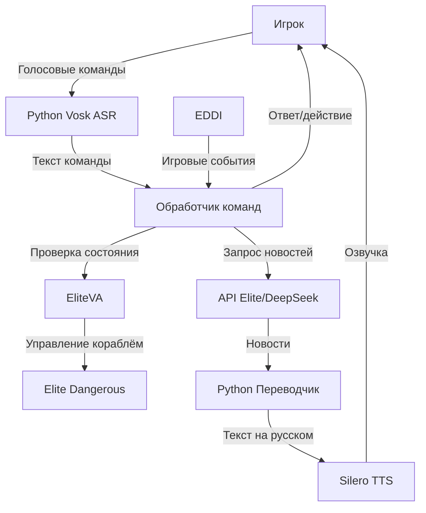

# Elite Dangerous Voice Control System

Голосовое управление для Elite Dangerous на Python с поддержкой Vosk (ASR) и Silero (TTS)

 <!-- Замените на реальный скриншот -->

## 🔥 Возможности

- **Активация по голосу**: Система реагирует на ключевое слово "Гидеон"
- **20+ команд**: Управление щитами, гиперпрыжками, шасси и другими системами корабля
- **Шумоподавление**: Работает даже при фоновых звуках двигателя
- **Голосовые ответы**: Естественное озвучивание через Silero TTS
- **Гибкая настройка**: Все команды редактируются в простом JSON-файле

## 📦 Установка

1. **Требования**:
   - Python 3.8+
   - Windows/Linux/macOS
   - Микрофон

2. **Установка зависимостей**:
   ```bash
   pip install -r requirements.txt

3. **Дополнительно для Windows**:

bash
pip install webrtcvad-win  # Если стандартный webrtcvad не устанавливается

## 🗺️ Архитектура


🚧 **Текущие задачи**
1. Интеграция с EDD:

    Реализовать обработку игровых событий (атака, нехватка топлива, завершение стыковки) через EDDI.

    Добавить голосовые уведомления для критических ситуаций.
    Пример:

    python
    if game_event == "UnderAttack":
        tts.speak("Внимание! Обнаружена атака!")

     Чтение журналов игры (Journal.log)

3. **Автоматические реакции на события**:

    "Обнаружена атака" → авто-щиты

    "Низкий уровень топлива" → предупреждение

    Улучшение точности

4. **Дообучение модели Vosk на игровых терминах**

Персонализация под голос пользователя

5. **Новые функции**

    Голосовые макросы (например, "боевой режим" → щиты+оружие)

    Поддержка мультиязычных команд

6. **Улучшение обработки команд**
    Внедрить систему приоритетов для конфликтующих команд.

    Добавить веса для фраз в commands.json:

        json
        "phrases": [
            {"text": "щиты", "weight": 0.9},
            {"text": "активируй защиту", "weight": 0.7}
        ]    
7. **Безопасность и надежность**
    Ограничить доступ pyautogui только необходимыми клавишами.

    Добавить подтверждение для опасных команд (например, "Подтвердите активацию самоуничтожения").
    
8. Асинхронный TTS
    Реализовать неблокирующее воспроизведение голосовых ответов:

    python
    def speak_async(text):
    Thread(target=tts.speak, args=(text,)).start()  

9. **Тестирование и оптимизация**
    Написать юнит-тесты для ключевых модулей (tests/).

    Оптимизировать шумоподавление для разных акустических условий.      
    
## 🚧 Вопросы для уточнения и задачи

### Интеграция с EliteVA
- **Текущий статус**: В процессе разработки.
- **Вопросы**:
  - Какой формат данных использует EliteVA (JSON/XML/plain text)?
  - Какие методы API доступны для проверки состояния корабля?
  - Как обрабатывать задержки при запросах к EliteVA?
- **Задачи**:
  - [ ] Реализовать WebSocket-клиент для EliteVA.
  - [ ] Настроить запросы к статусу топлива, щитов и позиции.

### Работа с DeepSeek API
- **Текущий статус**: Требуется настройка.
- **Вопросы**:
  - Какой тип аутентификации используется (API-key/OAuth)?
  - Какие эндпоинты доступны для получения новостей?
- **Задачи**:
  - [ ] Интегрировать модуль запросов к API.
  - [ ] Добавить обработку ошибок (таймауты, квоты).

### Приоритизация событий
- **Текущий статус**: На этапе тестирования.
- **Вопросы**:
  - Какие события EDDI должны иметь максимальный приоритет?
  - Как обрабатывать конфликтующие команды?
- **Задачи**:
  - [ ] Реализовать систему приоритетов в `commands.json`.
  - [ ] Протестировать в бою и при стыковке.

